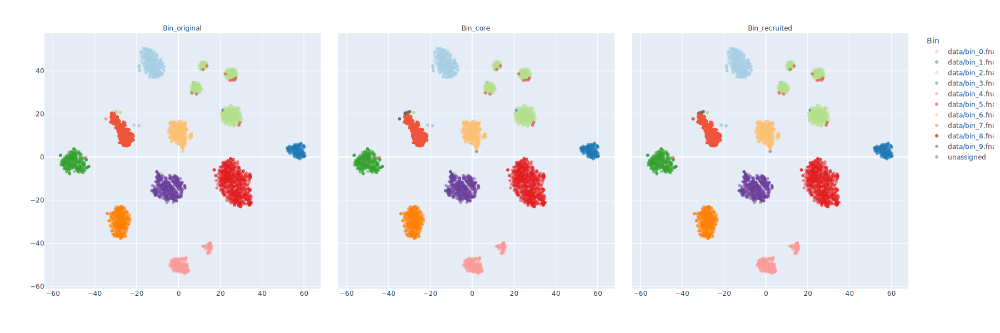

# Bin detangling workflow

This is a work-in-progress collection of scripts for the refinement of metagenome-assembled genomes (MAGs) using a combination of emergent self-organising maps (ESOM) and machine-learning algorithms. This is not intended to work as a single all-in-one package, as there are too many stages to refinement that require user intervention and judgement calls. Instead, this repository is a collection of scripts that are called together to walk through a series of pre-computed bins and coverage files to achieve the outcome.

The documentation will improve as scripts are finalised and the workflow is validated.

## Introduction

The idea behind this analysis is that you have obtained a metagenomic assembly, and are trying to identify clusters of contigs which belong to the same organism, or group of closely related organisms. There are a number of excellent automated pipelines for the recovery of these organism bins (or MAGs; **M**etagenomic-**A**ssembled **G**enomes), and the outputs of these pipelines are a good place to begin this workflow.

Three binning tools I frequently use are:

* [MetaBAT](https://bitbucket.org/berkeleylab/metabat) ([Kang et al., 2015](https://peerj.com/articles/1165/))
* [MaxBin](https://sourceforge.net/projects/maxbin/) ([Wu et al., 2014](https://microbiomejournal.biomedcentral.com/articles/10.1186/2049-2618-2-26))
* [CONCOCT](https://github.com/BinPro/CONCOCT) ([Alneberg et al., 2014](https://www.ncbi.nlm.nih.gov/pubmed/25218180))
* [GroopM](https://github.com/Ecogenomics/GroopM) ([Imelfort et al., 2014](https://www.ncbi.nlm.nih.gov/pmc/articles/PMC4183954/))

This workflow employs some biology-agnostic clustering techniques to evaluate the evidence for bin formation and membership and is not intended as a replacement for any of these tools. These scripts are for refining problematic bins and ensuring the quality of bins obtained from these software suites.

*Note - technically you **could** perform binning with this workflow, but I wouldn't recommend it.*

## Quick-fire use

Using the initial bins produced in the Genomics Aotearoa [Metagenomics Summer School](https://genomicsaotearoa.github.io/metagenomics_summer_school/).

Start by mapping the data to produce the coverage table required for the binning refinement. There are two binned data sets here, the raw bins (`bin_*.fna`), and those that have been through [DAS_Tool](https://github.com/cmks/DAS_Tool) refinement.

### Preparing the sequence data

Running through the data with the raw (pre-[DAS_Tool](https://github.com/cmks/DAS_Tool)) bins.

```bash
bowtie2-build data/spades_assembly.m1000.fna data/spades_assembly.m1000

for i in {1..4};
do
    bowtie2 --sensitive-local --threads 4 -x data/spades_assembly.m1000 -1 data/sample${i}_R1.fastq.gz -2 data/sample${i}_R2.fastq.gz > sample${i}.sam
    samtools view -bS sample${i}.sam | samtools sort -o sample${i}.bam
    samtools depth -a sample${i}.bam > sample${i}.depth.txt
done

# Create per-contig summary of the depths
python bin/compute_depth_profile.py -o results/depth.parquet sample{1..4}.depth.txt
```

Fortunately, the refined bins have a different extension to the raw versions, so they are easy to sort by wildcard.

### Identifying cores and recruiting residual fragments

```bash
python bin/compute_kmer_profile.py -k 4 -o results/raw_bins.parquet -f results/raw_bins.fna -t 4 data/bin_*.fna

python bin/project_ordination.py -n yeojohnson -w 0.5 --store_features results/raw_bins.matrix.tsv -k results/raw_bins.parquet -c results/depth.parquet -o results/raw_bins.tsne.parquet

python bin/identify_bin_cores.py --threshold 0.8 --plot_traces -i results/raw_bins.tsne.parquet -o results/raw_bins.tsne_core.parquet
```

From here, machine learning models can be produced against the core fragments for each bin, then used to re-assign additional non-core fragments back to the bin and determine the final state of the contigs.

```bash
python bin/recruit_by_ml.py train -i results/raw_bins.tsne_core.parquet -o recruitment_example/ --neural_network --random_forest --svm_linear --svm_radial

python bin/recruit_by_ml.py recruit \
    -i results/raw_bins.tsne_core.parquet \
    --random_forest recruitment_example/random_forest_0.pkl \
    --neural_network recruitment_example/neural_network_0.pkl \
    --svm_linear recruitment_example/svm_linear_0.pkl \
    --svm_radial recruitment_example/svm_rbf_0.pkl \
    --threshold 0.8 \
    -o results/raw_bins.recruited.tsv
```

### Inspecting the outputs

This output file can now be parsed to write out new bins with the resolved contigs, with or without filtering on the support level. For example:

```python
import polars as pl
from Bio import SeqIO

asm_dict = SeqIO.to_dict(SeqIO.parse('data/spades_assembly.m1000.fna', 'fasta'))

df = (
    pl
    .scan_csv('results/raw_bins.recruited.tsv', separator='\t')
    .filter(
        pl.col('Bin').ne('unassigned')
        #pl.col('Support').ge(0.9)
    )
    .collect()
)

for (bin_path,), bin_df in df.group_by(['Bin']):
    new_path = bin_path.replace('.fna', '.refined.fna')
    with open(new_path, 'w') as bin_writer:
        for contig in bin_df.get_column('Contig'):
            _ = SeqIO.write(asm_dict[contig], bin_writer, 'fasta')
```

It might also help to compare the TSNE ordination with the original bin assignments and the core/recruited bins.

```python
import plotly.express as px
import polars as pl

df = (
    pl
    .read_parquet('results/raw_bins.tsne_core.parquet')
    .join(
        pl.read_csv('results/raw_bins.recruited.tsv', separator='\t'),
        on='Contig',
        how='left'
    )
    .with_columns(
        Bin_original=pl.col('Source'),
        Bin_core=pl
            .when(pl.col('Core'))
            .then(pl.col('Source'))
            .otherwise(pl.col('Bin')),
        Bin_recruited=pl.col('Bin')
    )
    .select('Bin_original', 'Bin_core', 'Bin_recruited', 'TSNE_1', 'TSNE_2')
)

# Slice and stack the data frame for faceting
plot_df = pl.concat([
    df.select('TSNE_1', 'TSNE_2', pl.col('Bin_original').alias('Bin')).with_columns(Label=pl.lit('Bin_original')),
    df.select('TSNE_1', 'TSNE_2', pl.col('Bin_core').alias('Bin')).with_columns(Label=pl.lit('Bin_core')),
    df.select('TSNE_1', 'TSNE_2', pl.col('Bin_recruited').alias('Bin')).with_columns(Label=pl.lit('Bin_recruited')),
])

# Set colours using ColorBrewer2.org, 10 qualitative colours and half-transparency,
# manually setting 'unassigned' to grey.
colour_map = {
    'data/bin_0.fna': 'rgba(166, 206, 227, 0.5)',
    'data/bin_1.fna': 'rgba(31, 120, 180, 0.5)',
    'data/bin_2.fna': 'rgba(178, 223, 138, 0.5)',
    'data/bin_3.fna': 'rgba(51, 160, 44, 0.5)',
    'data/bin_4.fna': 'rgba(251, 154, 153, 0.5)',
    'data/bin_5.fna': 'rgba(227, 26, 28, 0.5)',
    'data/bin_6.fna': 'rgba(253, 191, 111, 0.5)',
    'data/bin_7.fna': 'rgba(255, 127, 0, 0.5)',
    'data/bin_8fna': 'rgba(202, 178, 214, 0.5)',
    'data/bin_9.fna': 'rgba(106, 61, 154, 0.5)',
    'unassigned': 'rgba(100, 100, 100, 0.5)',
}

fig = px.scatter(
    x=plot_df['TSNE_1'],
    y=plot_df['TSNE_2'],
    color=plot_df['Bin'],
    facet_col=plot_df['Label'],
    color_discrete_map=colour_map,
    width=1800,
    height=600,
    labels=dict(x='', y='', color='Bin')
)
fig.for_each_annotation(lambda a: a.update(text=a.text.split('=')[-1]))
fig.write_image('img/raw_bins_recruitment.svg')

```



---
